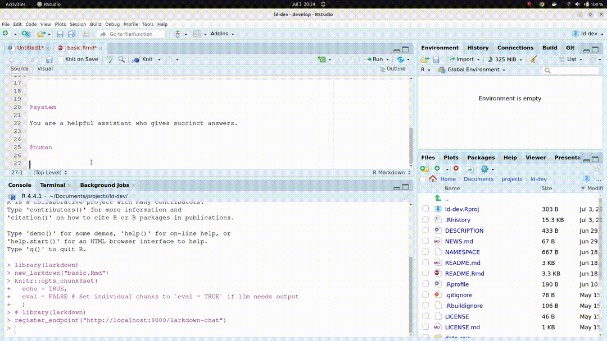

<!-- README.md is generated from README.Rmd. Please edit that file -->

```{r, include = FALSE}
knitr::opts_chunk$set(
  collapse = TRUE,
  comment = "#>",
  fig.path = "man/figures/README-",
  out.width = "100%"
)
```

# Larkdown

<!-- badges: start -->
<!-- badges: end -->

**Larkdown** is an R package that transforms Rmarkdown documents into a chat interface for Large Language Models (LLMs). Built to work with [LangChain](https://github.com/langchain-ai/langchain) and [LangServe](https://github.com/langchain-ai/langserve).



## Table of Contents
- [Introduction](#introduction)
- [Installation](#installation)
- [Usage](#usage)
- [Features](#features)
- [Caveats](#caveats)
- [Contributing](#contributing)
- [License](#license)

## Introduction

Larkdown provides a simple interface for chatting with LLMs through Rmarkdown documents in Rstudio. Why would you want to do this? Compared to other interfaces for working with chat models, Rmarkdown has some nice features:

- **Code Execution**: Execute code directly within the Rmarkdown document, supporting multiple languages like Python, SQL, and more.
- **Editable Chat History**: Easily edit upstream messages, correct errors, or modify instructions.
- **Flexible Chat Interface**: Use any LLM provider by configuring the endpoint, giving you freedom from provider lock-in.
- **Rstudio Integration**: Includes Rstudio addins and keyboard shortcuts for a streamlined workflow.
- **Persistent Conversations**: Store chat history as text files and resume conversations effortlessly.
- **Customizable Output**: Render conversations in various formats including HTML and PDF.


## Installation

To get started with Larkdown, you can install the development version from GitHub:

```{r, echo = FALSE, message=FALSE, warning=FALSE}
library(larkdown)
```


```{r, eval = FALSE}
devtools::install_github("markwh/larkdown")
library(larkdown)
```

Larkdown requires a deployed [LangServe endpoint](https://github.com/langchain-ai/langserve). This can be configured using the `register_endpoint()` function:

```{r, eval = FALSE}
register_endpoint("your_endpoint_url")
```

## Usage

Creating a new Larkdown document is simple. Use the `new_larkdown()` function to start a new chat interface:

```{r, eval = FALSE}
new_larkdown("my_chat.Rmd")
```

Interact with the document by knitting and submitting it to the LLM endpoint:

```{r, eval = FALSE}
knit_and_stream_current()
```


## Caveats

Larkdown is currently designed with a specific workflow in mind and may not be universally applicable. It is not built to be production-grade or universally stable. Users are encouraged to adapt and extend the tool to fit their own needs.

## Contributing

Contributions are welcome. Feel free to open issues and submit pull requests. Larkdown aims to inspire others to build their own tools and workflows for interacting with AI.

## License

Larkdown is licensed under the MIT License. See the [LICENSE](LICENSE) file for more details.